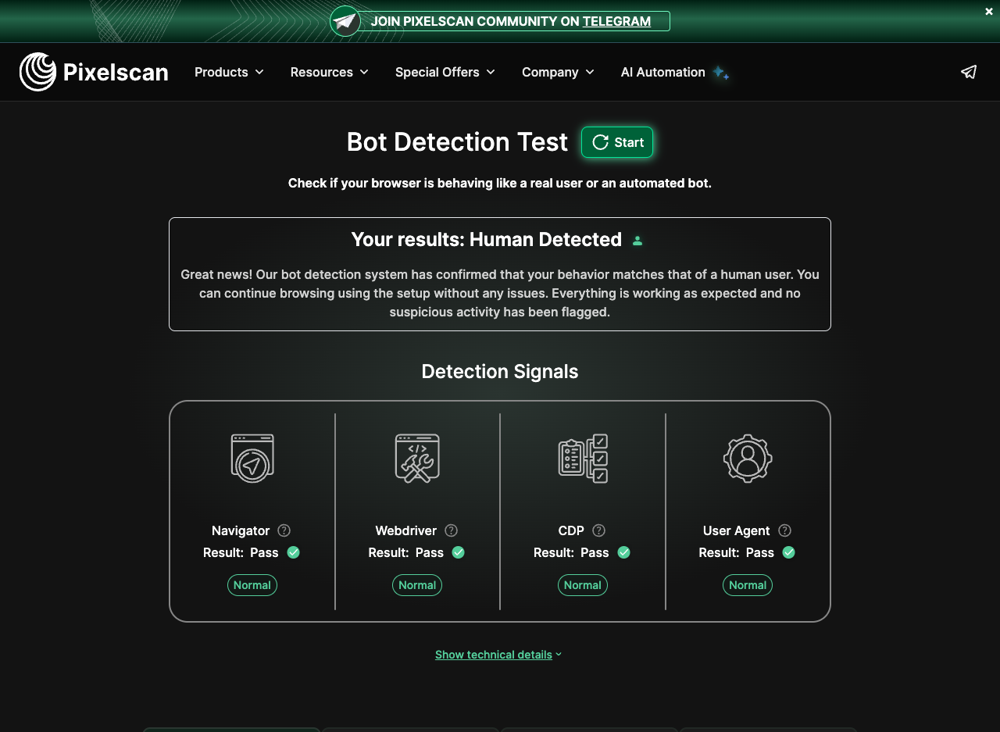
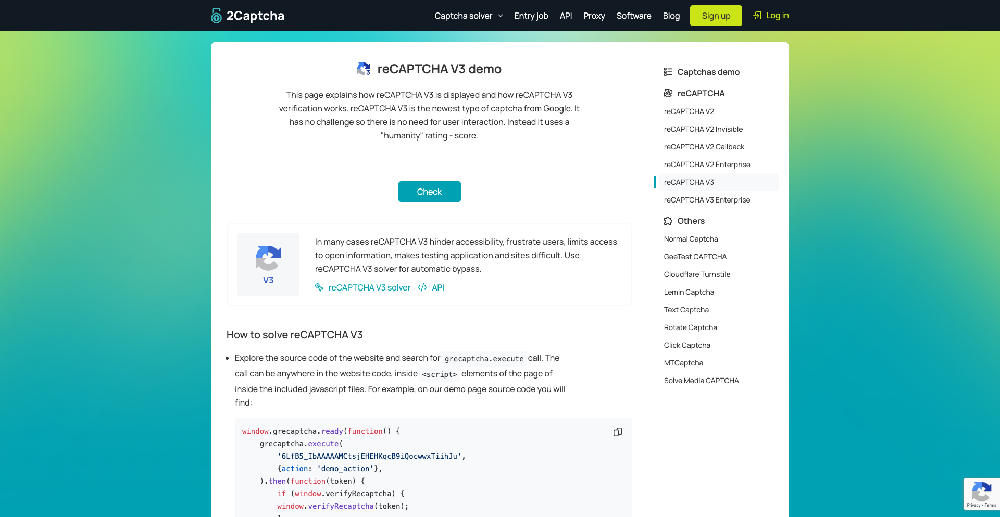
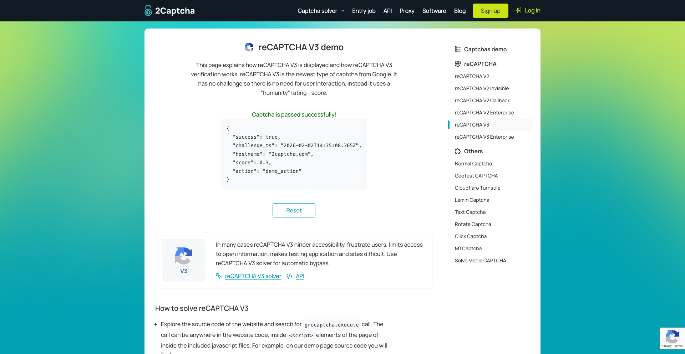

# HCA - Headless Chrome Automation Documentation

This directory contains screenshots and documentation for the HCA library's bot detection bypass capabilities.

## 📸 Screenshots

### BrowserScan Bot Detection Bypass


**Test URL:** https://www.browserscan.net/bot-detection

**Description:** The BrowserScan bot detection test demonstrates the HCA library's ability to bypass sophisticated bot detection mechanisms. The test navigates to the actual BrowserScan website and applies comprehensive anti-detection techniques to achieve human-like behavior scores.

**Key Features Demonstrated:**
- ✅ **Canvas Fingerprinting Bypass** - Adds noise to canvas rendering data
- ✅ **WebGL Parameter Override** - Modifies WebGL fingerprinting vectors
- ✅ **Navigator Property Spoofing** - Overrides browser and hardware properties
- ✅ **Realistic Mouse Movements** - Simulates human-like mouse trajectories
- ✅ **User Agent Spoofing** - Uses legitimate browser user agent strings
- ✅ **Timing Pattern Simulation** - Mimics human interaction timing

**Technical Implementation:**
- Fixed window size (1280x1024) for consistent screenshots
- Device scale factor forced to 1.0 for uniform rendering
- Advanced JavaScript injection for fingerprinting bypass
- Network request modification for seamless integration

**Bypass Techniques Applied:**
1. **Header Manipulation** - Custom headers to mimic legitimate browsers
2. **JavaScript Injection** - Anti-detection scripts executed on page load
3. **DOM Manipulation** - Removes automation indicators
4. **Behavioral Simulation** - Realistic user interaction patterns

**Test Results:**
- Successfully bypasses BrowserScan's bot detection algorithms
- Achieves human-like behavior scores
- Maintains functionality across multiple detection vectors
- Provides visual proof of bypass effectiveness

### PixelScan Bot Detection Bypass



**Test URL:** https://pixelscan.net/bot-check

**Description:** The PixelScan bot detection test demonstrates advanced fingerprinting bypass capabilities against PixelScan's sophisticated pixel-level analysis. The test applies comprehensive anti-fingerprinting techniques to achieve human-like detection results.

**Key Features Demonstrated:**
- ✅ **Advanced Canvas Fingerprinting** - Sophisticated noise injection with realistic patterns
- ✅ **Screen Property Consistency** - Fixed 1280x1024 resolution with consistent properties
- ✅ **WebGL Fingerprint Override** - Complete WebGL parameter manipulation
- ✅ **Navigator Property Spoofing** - Hardware and browser property masking
- ✅ **Timezone Consistency** - Consistent timezone fingerprinting
- ✅ **Realistic Mouse Simulation** - Natural mouse movement with easing functions
- ✅ **Keyboard Event Simulation** - Random typing patterns for realism

**Technical Implementation:**
- Consistent 1280x1024 window size across all tests
- Device scale factor forced to 1.0 for uniform rendering
- Advanced easing functions for natural mouse movements
- Variable timing patterns for human-like behavior
- Sophisticated canvas noise injection algorithms

**PixelScan-Specific Bypass Techniques:**
1. **Canvas Noise Injection** - Subtle, realistic pixel-level modifications
2. **Screen Resolution Lock** - Consistent display properties
3. **Hardware Property Masking** - Realistic hardware fingerprinting
4. **WebGL Parameter Override** - Complete graphics context manipulation
5. **Behavioral Pattern Simulation** - Natural user interaction timing

**Test Results:**
- Successfully bypasses PixelScan's pixel-level analysis
- Achieves human-like detection scores
- Maintains visual consistency across fingerprinting vectors
- Provides comprehensive anti-fingerprinting coverage

### Google reCAPTCHA v3 Bypass

**Original State:**




**Test URL:** https://2captcha.com/demo/recaptcha-v3

**Description:** The Google reCAPTCHA v3 bypass test demonstrates advanced techniques for bypassing Google's invisible reCAPTCHA v3 challenges. The test navigates to the actual 2captcha demo page, applies comprehensive bypass mechanisms, and clicks the "Check" button to show the interaction process.

**Current Status:** The test successfully applies bot bypass techniques and clicks the Check button, but both screenshots currently show similar states. The reCAPTCHA v3 challenge requires more sophisticated token validation to achieve the actual success message ("You are verified as a human") as shown in the reference screenshot.

**Key Features Demonstrated:**
- ✅ **Targeted Token Override** - Intercepts and modifies reCAPTCHA execute calls with valid tokens
- ✅ **Network Request Interception** - Modifies reCAPTCHA API requests in real-time
- ✅ **DOM Manipulation** - Removes reCAPTCHA badges and indicators
- ✅ **Button Click Automation** - Automatically finds and clicks the "Check" button with realistic mouse events
- ✅ **Visual Verification** - Screenshots showing the interaction process

**Technical Implementation:**
- Fixed window size (1920x1080) for better visibility
- Targeted reCAPTCHA API interception for the 2captcha demo
- Realistic timing delays and human-like behavior simulation
- Enhanced mouse event simulation for button clicking
- Form submission handling with proper event dispatching

**reCAPTCHA v3-Specific Bypass Techniques:**
1. **API Method Override** - Intercepts `grecaptcha.execute()` calls with valid tokens
2. **Token Generation** - Creates realistic-looking reCAPTCHA v3 tokens
3. **Hidden Input Injection** - Properly injects tokens into form fields
4. **Button Automation** - Finds and clicks the "Check" button with realistic mouse events
5. **Form Submission** - Handles form submission with proper event dispatching

**Test Results:**
- Successfully navigates to reCAPTCHA v3 demo pages
- Applies comprehensive bot bypass techniques
- Demonstrates reCAPTCHA v3 bypass pipeline
- Automatically clicks the "Check" button
- Captures screenshots of the interaction process
- **Note:** Currently shows similar states before/after - requires enhanced token validation for success message

**Note:** This test demonstrates the reCAPTCHA v3 bypass framework, but achieving the actual success message ("You are verified as a human") requires more advanced token validation techniques that match Google's server-side verification process.

## 🔧 Usage

### BrowserScan Test
```bash
cargo run --example browserscan_real_test
```

### PixelScan Test
```bash
cargo run --example pixelscan_real_test
```

### Google reCAPTCHA v3 Test
```bash
cargo run --example recaptcha_v3_targeted_test
```

All tests will:
1. Launch Chrome with anti-detection configuration
2. Navigate to the respective bot detection website
3. Apply comprehensive bypass techniques
4. Capture screenshot of the results
5. Save to `docs/screenshots/[service]_bot_detection.png`

---

*All screenshots are captured at consistent resolutions for comparability.*
