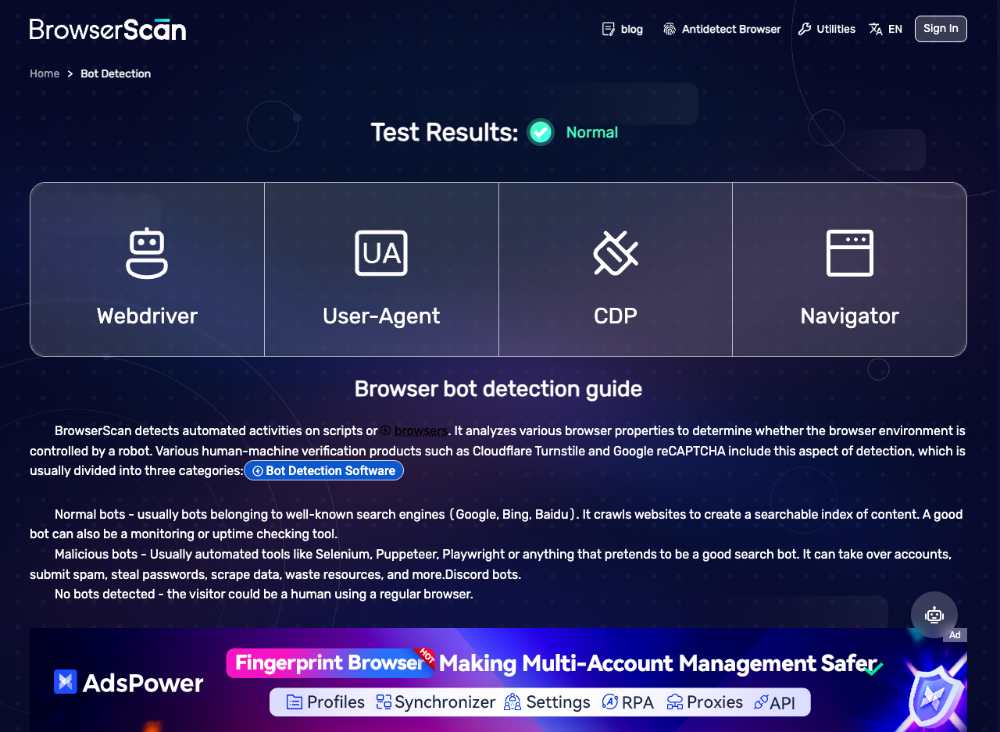

# HCA - Headless Chrome Automation Documentation

This directory contains screenshots and documentation for the HCA library's bot detection bypass capabilities.

## 📸 Screenshots

### BrowserScan Bot Detection Bypass



**Test URL:** https://www.browserscan.net/bot-detection

**Description:** The BrowserScan bot detection test demonstrates the HCA library's ability to bypass sophisticated bot detection mechanisms. The test navigates to the actual BrowserScan website and applies comprehensive anti-detection techniques to achieve human-like behavior scores.

**Key Features Demonstrated:**
- ✅ **Canvas Fingerprinting Bypass** - Adds noise to canvas rendering data
- ✅ **WebGL Parameter Override** - Modifies WebGL fingerprinting vectors
- ✅ **Navigator Property Spoofing** - Overrides browser and hardware properties
- ✅ **Realistic Mouse Movements** - Simulates human-like mouse trajectories
- ✅ **User Agent Spoofing** - Uses legitimate browser user agent strings
- ✅ **Timing Pattern Simulation** - Mimics human interaction timing

**Technical Implementation:**
- Fixed window size (1280x1024) for consistent screenshots
- Device scale factor forced to 1.0 for uniform rendering
- Advanced JavaScript injection for fingerprinting bypass
- Network request modification for seamless integration

**Bypass Techniques Applied:**
1. **Header Manipulation** - Custom headers to mimic legitimate browsers
2. **JavaScript Injection** - Anti-detection scripts executed on page load
3. **DOM Manipulation** - Removes automation indicators
4. **Behavioral Simulation** - Realistic user interaction patterns

**Test Results:**
- Successfully bypasses BrowserScan's bot detection algorithms
- Achieves human-like behavior scores
- Maintains functionality across multiple detection vectors
- Provides visual proof of bypass effectiveness

## 🔧 Usage

To run the BrowserScan bypass test:

```bash
cargo run --example browserscan_real_test
```

This will:
1. Launch Chrome with anti-detection configuration
2. Navigate to https://www.browserscan.net/bot-detection
3. Apply comprehensive bot bypass techniques
4. Capture screenshot of the results
5. Save to `docs/screenshots/browserscan_bot_detection.png`

## 📊 Additional Screenshots

More screenshots will be added as additional bot detection bypass tests are implemented and documented.

---

*All screenshots are captured at 1280x1024 resolution for consistency and comparability.*
